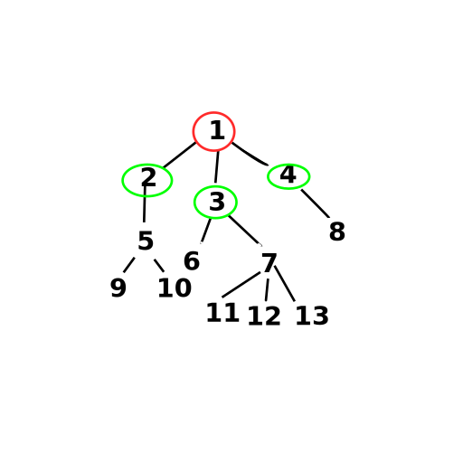
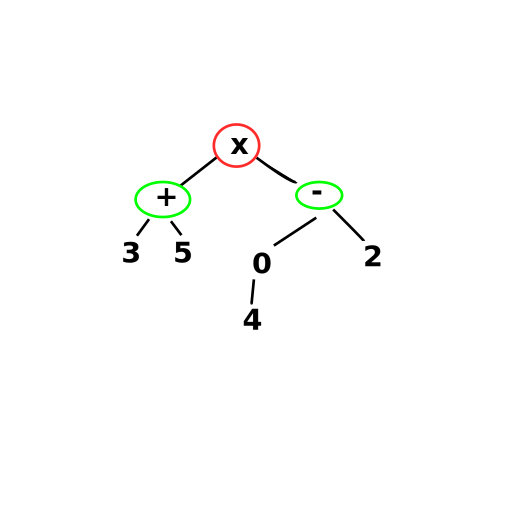
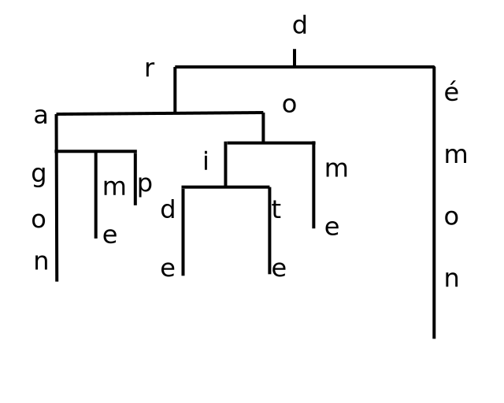
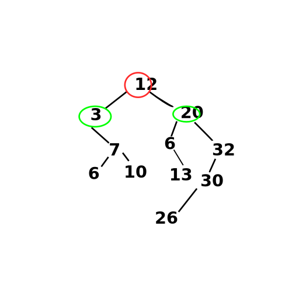

# Arbres

## I - Introduction et 1ieres def


> [!NOTE]
> **Exemple**<br>
> 


> [!TIP]
> **Déf**<br>
> Un arbre est une structure de données, consituées de n noeuds qui peuvent être étiquettés<br>

S'il n'est pas vide (i.e. si n >= 1) il est structuré comme suit:
- noeud particulier r nommé **racine**
- les n-1 (éventuels) autres éléments sont partitionnés en k >= 0 ens disjoints qui forment k arbres appelés sous-arbres.
- la racine est liée aux sous-arbres


> [!NOTE]
> **Exemple**<br>
> cf ex prec


> [!CAUTION]
> **Rmq**<br>
> Beaucoup de variations de cette def existent

Vocabulaire: cf annexe


> [!NOTE]
> **Exemple**<br>
> - l'arité de **4** est 1
> - l'arité de **12** est 0
> - l'arité de **1** est 3
> - le noeud **2** est l'ancêtre de 5, 9, 10
> - l'arbre est de hauteur 3


> [!NOTE]
> **Exemple**<br>
> (3+5) (e^4-2)
> 


> [!NOTE]
> **Exemple**<br>
> Un Trie pour reprrésenter de manière plus compacte un ens de mots en exploitant leurs pref communs.
>
> e.g = {dragon, drame, drap, droide, droit, droite, drone, dé, déemon}
> 


> [!NOTE]
> **Exemple**<br>
> Arbres Binaires de Recherche (ABR)
> Pour chq noeud x, tous les noeuds du sous-arbres geuche de x est une étiquette inférireur à la sienne et sym à droite
> 
> /!\ Pour faire un ABR, il faut un ordre total

## II - Arbres binaires

### 1. Déf

> [!TIP]
> **Déf**<br>
> Soit E un ensemble d'étiquettes
>
> L'ensemble A(E) des arbres binaires est défini inductivement par:
> - L'arbre vide, noté _|\_, est un arbre binaire

Si (g, d) ⊂ A(E)², alors pour e ∈ E, N(e, g, d), est un arbre binaire

> [!CAUTION]
> **Rmq**<br>
> - C'est donc un abre dont les noeuds sont d'arité au plus 2
> - parfois, on pose la feuille et non _|\_ comme cas de base; mais cela demande de créer de noiuveaux constructeur rec pour gérer 
> ```
> 0          0
>  \   ou   /
>   0      0
> ```


> [!CAUTION]
> **Rmq**<br>
> Voici d'autres variantes de la def:
> - arbre où on ne dit pas qui est la racine, e.g:
>   ```
>   o             o
>    \           /
>     o ------- o
>    /           \
>   o             o
>   ```
>   lorsqu'on spécifie sa hiérarchie, on " l'enracine "
> - on peut étiquetter des abres par les arêtes


> [!TIP]
> **Déf/Rmq**<br>
> Un feuille d'un arbre binaire est de la forme N(e, _|\_, _|\_)


> [!CAUTION]
> **Rmq**<br>
> Les arbres étant un type, on peut y déf des fonctions par réc


> [!NOTE]
> **Déf/Ex**<br>
> La hauteur d'un arbre binaire est déf par:
> - h(_|\_) = -1
> - h(N(e, g, d)) = 1 + max h(g) h(d)


> [!CAUTION]
> **Rmq**<br>
> - poser h(_|\_) = -1 permet que la hauteur de l'arbre-feuille soit 0:
> ```
> O (h=0)
> ```
> cela permet de lier hauteur et lg de chemin


### 2. Arbres binaires particuliers

> [!TIP]
> **Déf**<br>
> Soient *I* et *F* deux ens d'étiquettes. Un arbre binaire strict est déf induc. par:
> - les feuilles sont des arbres bin str, F(f) avec f ∈ *F*
> - Si g et d sont des abres bin str:
> N(i, g, d) est un arbre binaire str avec i ∈ *I*


> [!CAUTION]
> **Rmq**<br>
> Dans un arbre, un noeud qui n'est pas une feuille est dit interne


> [!IMPORTANT]
> **Propiété**<br>
> Un arbre binaire strict est un arbre binaire non-vide dont les noeuds sont d'arité 0 ou 2


> [!TIP]
> **Déf**<br>
> Un arbre binaire parfait (def inductive):
> - soit vide
> - soit de forme (N_, g, d) avec g et d parfaits et de **meme hauteur**
> 
> ```
>                     O
>                    / \
>                   /   \
>                  /     \
>                 /       \
>                /         \
>               /           \
>              /             \
>             /               \
>            /                 \
>           O                   O
>          /\                   /\
>         /  \                 /  \
>        /    \               /    \
>       /      \             /      \
>      /        \           /        \
>     O          O         O          O
>     /\        /\         /\        /\
>    /  \      /  \       /  \      /  \    
>   /    \    /    \     /    \    /    \
>  O      O  O      O   O      O  O      O
> ```


> [!IMPORTANT]
> **Propiété**<br>
> Aux étiquettes près, il existe un seul arbre parfait de hauteur donnée


Preuve: par récurrence sur la hauteur n ∈ (**N**⋃{-1}, <=)

__Init__: si n = -1, le seul arbre de hauteur -1 est _|\_. Il est parfait

__Hérédité__: Soit n ∈ **N**. Supposon la prop vraie pour tout n' < n, montrons-la vraie pour n

Par déf, aux étiquettes près, un arbre parfait de hauteur n de la forme N(\_, g, d) avec g et d parfaits de même hauteur. 

Or h(N(\_, g, d)) = 1 + max h(g) h(d) = 1 + h(g) car h(g) = h(d)

Donc par H.R., g et d sont fixés (unique choix)

Il y a donc un unique N(_, g, d) de hauteur n

__Conclusion__: On a prouvé la prop par rec


> [!IMPORTANT]
> **Propiété**<br>
> Un arbre binaire strict est parfait SSI toutes ses feuilles sont à la même profondeur

Preuve: => par I.S.

**Init**: La feuille est le cas de base des a.b.s. Elle est parfaite par déf. Elle n'a pas d'enfants, donc toutes ses feuilles (i.e elle-même sont à même profondeur)

**Hérédité**: Supposons la propriété vraie pour deux a.b.s  g et d, montrons-la vraie pour N(\_, g, d)

