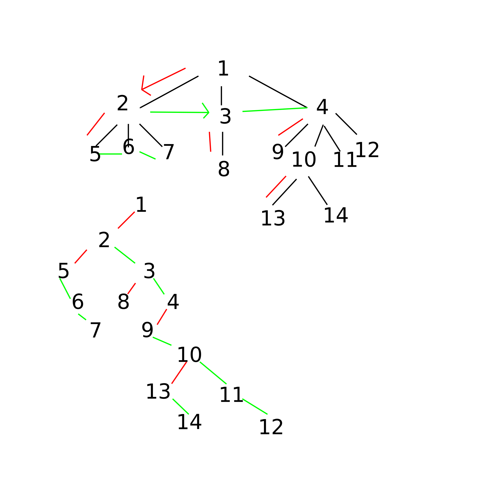

# Arbres

## I - Introduction et 1ieres def


> [!NOTE]
> **Exemple**<br>
> 


> [!TIP]
> **Déf**<br>
> Un arbre est une structure de données, consituées de n noeuds qui peuvent être étiquettés<br>

S'il n'est pas vide (i.e. si n >= 1) il est structuré comme suit:
- noeud particulier r nommé **racine**
- les n-1 (éventuels) autres éléments sont partitionnés en k >= 0 ens disjoints qui forment k arbres appelés sous-arbres.
- la racine est liée aux sous-arbres


> [!NOTE]
> **Exemple**<br>
> cf ex prec


> [!CAUTION]
> **Rmq**<br>
> Beaucoup de variations de cette def existent

Vocabulaire: cf annexe


> [!NOTE]
> **Exemple**<br>
> - l'arité de **4** est 1
> - l'arité de **12** est 0
> - l'arité de **1** est 3
> - le noeud **2** est l'ancêtre de 5, 9, 10
> - l'arbre est de hauteur 3


> [!NOTE]
> **Exemple**<br>
> (3+5) (e^4-2)
> 


> [!NOTE]
> **Exemple**<br>
> Un Trie pour reprrésenter de manière plus compacte un ens de mots en exploitant leurs pref communs.
>
> e.g = {dragon, drame, drap, droide, droit, droite, drone, dé, déemon}
> 


> [!NOTE]
> **Exemple**<br>
> Arbres Binaires de Recherche (ABR)
> Pour chq noeud x, tous les noeuds du sous-arbres geuche de x est une étiquette inférireur à la sienne et sym à droite
> 
> /!\ Pour faire un ABR, il faut un ordre total


## II - Arbres binaires

### 1. Déf

> [!TIP]
> **Déf**<br>
> Soit E un ensemble d'étiquettes
>
> L'ensemble A(E) des arbres binaires est défini inductivement par:
> - L'arbre vide, noté _|\_, est un arbre binaire

Si (g, d) ⊂ A(E)², alors pour e ∈ E, N(e, g, d), est un arbre binaire

> [!CAUTION]
> **Rmq**<br>
> - C'est donc un abre dont les noeuds sont d'arité au plus 2
> - parfois, on pose la feuille et non _|\_ comme cas de base; mais cela demande de créer de noiuveaux constructeur rec pour gérer 
> ```
> 0          0
>  \   ou   /
>   0      0
> ```


> [!CAUTION]
> **Rmq**<br>
> Voici d'autres variantes de la def:
> - arbre où on ne dit pas qui est la racine, e.g:
>   ```
>   o             o
>    \           /
>     o ------- o
>    /           \
>   o             o
>   ```
>   lorsqu'on spécifie sa hiérarchie, on " l'enracine "
> - on peut étiquetter des abres par les arêtes


> [!TIP]
> **Déf/Rmq**<br>
> Un feuille d'un arbre binaire est de la forme N(e, _|\_, _|\_)


> [!CAUTION]
> **Rmq**<br>
> Les arbres étant un type, on peut y déf des fonctions par réc


> [!NOTE]
> **Déf/Ex**<br>
> La hauteur d'un arbre binaire est déf par:
> - h(_|\_) = -1
> - h(N(e, g, d)) = 1 + max h(g) h(d)


> [!CAUTION]
> **Rmq**<br>
> - poser h(_|\_) = -1 permet que la hauteur de l'arbre-feuille soit 0:
> ```
> O (h=0)
> ```
> cela permet de lier hauteur et lg de chemin

### 2. Arbres binaires particuliers

> [!TIP]
> **Déf**<br>
> Soient *I* et *F* deux ens d'étiquettes. Un arbre binaire strict est déf induc. par:
> - les feuilles sont des arbres bin str, F(f) avec f ∈ *F*
> - Si g et d sont des abres bin str:
> N(i, g, d) est un arbre binaire str avec i ∈ *I*


> [!CAUTION]
> **Rmq**<br>
> Dans un arbre, un noeud qui n'est pas une feuille est dit interne


> [!IMPORTANT]
> **Propiété**<br>
> Un arbre binaire strict est un arbre binaire non-vide dont les noeuds sont d'arité 0 ou 2


> [!TIP]
> **Déf**<br>
> Un arbre binaire parfait (def inductive):
> - soit vide
> - soit de forme (N_, g, d) avec g et d parfaits et de **meme hauteur**
> 
> ```
>                     O
>                    / \
>                   /   \
>                  /     \
>                 /       \
>                /         \
>               /           \
>              /             \
>             /               \
>            /                 \
>           O                   O
>          /\                   /\
>         /  \                 /  \
>        /    \               /    \
>       /      \             /      \
>      /        \           /        \
>     O          O         O          O
>     /\        /\         /\        /\
>    /  \      /  \       /  \      /  \    
>   /    \    /    \     /    \    /    \
>  O      O  O      O   O      O  O      O
> ```


> [!IMPORTANT]
> **Propiété**<br>
> Aux étiquettes près, il existe un seul arbre parfait de hauteur donnée


Preuve: par récurrence sur la hauteur n ∈ (**N**⋃{-1}, <=)

__Init__: si n = -1, le seul arbre de hauteur -1 est _|\_. Il est parfait

__Hérédité__: Soit n ∈ **N**. Supposon la prop vraie pour tout n' < n, montrons-la vraie pour n

Par déf, aux étiquettes près, un arbre parfait de hauteur n de la forme N(\_, g, d) avec g et d parfaits de même hauteur. 

Or h(N(\_, g, d)) = 1 + max h(g) h(d) = 1 + h(g) car h(g) = h(d)

Donc par H.R., g et d sont fixés (unique choix)

Il y a donc un unique N(_, g, d) de hauteur n

__Conclusion__: On a prouvé la prop par rec


> [!IMPORTANT]
> **Propiété**<br>
> Un arbre binaire strict est parfait SSI toutes ses feuilles sont à la même profondeur

Preuve: => par I.S.

**Init**: La feuille est le cas de base des a.b.s. Elle est parfaite par déf. Elle n'a pas d'enfants, donc toutes ses feuilles (i.e elle-même sont à même profondeur)

**Hérédité**: Supposons la propriété vraie pour deux a.b.s  g et d, montrons-la vraie pour N(\_, g, d)

On suppose donc que N(\_, g, d) est parfait, donc g et d sont parfaits et de meme hauteur

Les geuilles de g et d sont donc à même profondeur dans g et dans d; nommons-la h. Or, les feuilles de g sont des feuilles de N(\_, g, d), et y sont de prof h+1 (car il faut prendre en compte la racine). Idem pour d. Les feulles de g et de d sont les seules feuilles de N(\_, g, d), d'où le résultat

**Conclusion**: On a prouvé l' => par ind str

<= de même


> [!TIP]
> **Déf**<br>
> Un arbre binaire complet est un arbre binaire tel que tous les "niveaux" sont remplis, sauf éventuellement le dernier; qui est rempli autant que possible de gauche à droite


Ex: arbre complet à 5 noeuds:
```
    o
   / \
  o   o
 / \
o   o
```
à 12 noeuds:
```
        o
       / \
      /   \
     /     \
    o      o
   / \    / \
  o   o   o  o
 / \  |\  |
o   o o o o
```


> [!CAUTION]
> **Rmq**<br>
> Les arbres parfaits sont complets


> [!IMPORTANT]
> **Propiété**<br>
> Un arbre binaire complet de hauteur h, ayant n<sub>i</sub> noeuds internes et f feuilles vérifie
> - $2^h <= n_i +f <= 2^{h+1} - 1$<br>
> nb total de noeuds | ^ SSI parfait
> - Les feuilles sont à profonduer h-1 ou h
> - Il y a $n_i + f - (h^{h} - 1)$ noeuds à prof h
> - Il y a donc $2^{h} - 1 - n_i$ feuilles à prof $h-1$
> - $n_i = 2^h - 1 - \lfloor \frac{2^{h+1}-1-(n_i + f)}{2} \rfloor = \lfloor \frac{n_i + f}{2} \rfloor$
> Preuve: TD


> [!IMPORTANT]
> **Propiété**<br>
> Un arbre binaire strict ayant $n_i$ noeuds internes et f feuilles vérifie:
> ```
>   0
>  / \
> o   0
>    / \
>   0   0
>  / \  |\
> o   o o o
> ```
> f = 5 (o)
> $n_i$ 4 (0)
>
> Preuve Par I.S. sur un abs
>
> **Init**: si l'abs est une feuille,
> - f = 1
> - $n_i = 0$
>
> donc $f = n_i +1$
>
> **Hérédité**:
> Soient g et d deux abs vérifiant la ppté. Nommons $n_i^g$ et $n_i^d$ leurs nb de noeuds internes resp, et $f^g$, $f^d$ leurs feuilles.
>
> Montrons la ppté pour N(_,g, d) qui a $n_i$ noeuds internes et f feuilles
>
> On a : $n_i = n_i^g + n_i^d + 1$<br>
> $f = f^g + f^d$
>
> Donc: $n_i + 1 = n_i^g + 1 + n_i^d + 1 = f^g + f^d = f$
>
> **Conclusion**: On a prouvé l'égalité par I.S.


> [!TIP]
> **Déf**<br>
> Un peigne est un arbre dont les noeuds sont d'arité 1 ou 0
> ```
> o
>  \
>   o
>    \
>     o
>    /
>   o
>    \
>     o
> ```


> [!CAUTION]
> **Rmq**<br>
> C'est une liste chainée

### 3. Représentation dans un tableau

Si l'arbre est binaire complet: on range les noeuds dans le tableau dans "l'ordre de lecture" c'est à dire de gauche à droite, puis de haut en bas


> [!CAUTION]
> **Rmq**<br>
> Nemarche que sur les arbres binaires constants sinon on a des prblm d'ambiguïté de l'arité


> [!IMPORTANT]
> **Propiété**<br>
> Dans cette repr, le noeud d'indice i dans le tableau a:
> - pour parent le noeud d'indice $\lfloor \frac{i-1}{2} \rfloor$ (si i > 0)
> - pour enfant les noeuds d'indices 2i+1 et 2i+2

Si les étiquettes sont en bij avec [|0; n|], même si l'arbre n'est pas binaire: chq noeud aura un indice qui est son étiquette. Au lieu de stocker les enfances, on stocke les parentés, càd Tab[i] = j signifie que j est parent de i

NB: on fait ĉ si la racine était son propre parent

### 4. Arbres qcq

Type OCAML: cf annexes

Un aarbre est soit vide, soit une étiquettes et une liste de sous-arbres


> [!IMPORTANT]
> **Théorème**<br>
> On peut transformer un arbre qcq en arbre binaire de manière injective par le précédé LCRS (Left Child, Right Sibling):
> - On fait pointer chaque noeud de l'arbre d'origine vers son fils le + à gauche
> - ----------------------------------------------- vers son frère droit
>
> Ces deux arêtes définissent un arbre binaire
> Cette transformation n'est pas surjective. Elle et sa réciproque sont calculables en tps linéaire



> [!IMPORTANT] 
> **Lemme**: Dans un arbre binaire il y a au plus $2^p$ noeuds à profondeur p ( et cette borne est atteignable )

**Preuve**

**Init**: p = 0

$2^0 = 1$ noeud vrai

**Hérédité**:
On suppose la propriété vraie au rang p

Montrons la vraie au rang p+1

$2^{p+1} = 2^p * 2$  il y a donc $2^p$ noeuds à la profondeur p

Or les noeuds de profondeur p+1 sont les enfants des noeuds à la profondeur p et ils sont au nombre de 2 maximum par noeuds de profondeur p.

Donc on a au plus $2^p*2 = 2^{p+1}$ noeuds à la profondeur p+1n cette birbe est atteinte quand tout les noeuds de profondeur p ont 2 enfants et que $2^p$ était atteint.


Soit i € [|0; h|], L_i le nb d'élément à profondeur i

Le nombre de noeud de la racine à la hauteur h-1 est: $2^0 + 2^1 + ... + 2^{h-1} = \sum_{k=0}^{k-1}{2^k}$

$-1 + 2^k$ La ligne de hauteur h comporte au minimum 1 noeud et au plus 2^k noeuds

En sommant de façon triviale, on en déduit le résultat de la proposition


D'après la preuve de Florian BANROQUES

Il y a entre la profondeur 0 et h-1, $2^h- noeuds. Alors à profondeur h: $n_i + f - 2^h + 1$ noeuds donc $n_i + f + 1 - 2^h$ feuilles

noeuds internes = noeuds int à prof <= h-2)2^{h-1} - 1 + 

n_i + f = f^h + f^{h+1} + n_i - n_i + f - (2^h - 1) + f^{h-1} + \rfloor \frac{}{}


## III - Parcours d'arbres


> [!TIP]
> **Déf**<br>
> Un parcours d'arbre est une méthode permettant de visiter les noeuds de l'arbre dans un certain ordre


> [!CAUTION]
> **Rmq**<br>
> Les fonctions faites dans le TP Ocaml étaient des parcours


> [!CAUTION]
> **Rmq**<br>
> Dans ce cours, on traitera "la gauche avant la droite"

### 1. Parcours en profondeur


> [!TIP]
> **Déf**<br>
> Un parcours en profondeur (Depth First Search, DFS) consiste à se déplacer dans l'arbre en s'enfonçant **tant que l'on peut**. Lorsque l'on atteint une feuille on **remonte jusqu'à pouvoir s'enfoncer** dans un autre chemin


> [!CAUTION]
> **Rmq**<br>
> - c'est un parcours naturellement récursif!
> - on passe sur chq noeud interne a+1 fois avec a son arité (1 fois en descendant vers le noeud, et a fois en remontant depuis un enfant). De même pour les feuilles
> - on a donc un choix à faire: traiter le noeud en cours **avant** ses enfants, **entre** ses enfants ou **après** ses enfants
> - sur un arbre binaire, on parle resp. de parcours **préfixe**, **infixe**, **postfixe**

1) Parcours préfixe

On traite la racine puis, rec, chacun de ces sous arbres

Preudo-code: cf annexe

2) Parcours infixe

On traite un sous-arbre, puis la racine, puis l'autre sous-arbre

Pseudo-code: cf annexe

3) Parcours postfixe

On traite rec les sous-arbres puis la racine


> [!NOTE]
> **Exemple**<br>
> Pseudo-code: cf annexe

4) Compléments


> [!CAUTION]
> **Rmq**<br>
> On peut visualiser l'ordre de ces parcours à partir du chemin du DFS
> - Préfixe: on traite un noeud quand le chemin passe à sa gauche
> - Infixe: on traite un noeud quand le chemin passe à sa en dessous
> - Postfixe: on traite un noeud quand le chemin passe à sa droite

> [!CAUTION]
> **Rmq**<br>
> Lien avec la récursivité.<br>
> On peut dans utop tracer les appels d'une fonction rec (cf annexe) fibo 3 donne l'arbre

Les entrées (fibo <-- x) sont préfixes; on entre dans un appel avant d'entrer dans ses sous-appels.

Les sorties (fibo --> y) sont postfixes: on sort dans un appel avant de sortir dans ses sous-appels

Rmquez que cela induit un "ordre de début" et un "ordre de fin" -> cf tri topologique


> [!IMPORTANT]
> **Propriété/Remarque**<br>
> Grâce à la pile mémoire, cet arbre n'est jamais entièrement en mémoire: ne sont en mémoire que les appels commencés mais non terminé (début mais pas fin).
>
> Le coût spatial d'une fonction rec est donc la somme maximale des coûts spatiaux sur un chemin de la racine à une feuille de l'arbre d'appel


> [!NOTE]
> **Exemple**<br>
> Avec fibo, il y a au plus n-1 appels réc débutés non-terminé (n -> n-1 -> n-2 -> ... -> 1).
>
> Chq appel a un coût cst en mémoire. D'où une complexité spatiale E(n) = $\Theta$(n)!

2) Parcours Pile

Idée: on peut dé-récursifier le parcours à l'aide d'un `while` est d'une pile. La pile stocke les prochains noeuds à explorer

Avantages: 
- simplifier l'arrêt du parcours avant d'avoir tout visité  (e.g. dès qu'on a trouvé un elem)
- empiler les noeuds sur une pile est un peu plus léger qu'empiler les appels en mémoire (les appels ont des "métadonnées")

Inconvénients:
- plus technique à écrire
- plus technique à relire

> [!CAUTION]
> **Rmq**<br>
> Infixe et postfixe sont bcp plus durs à impératiser

### 2. Parcours en largeur


> [!TIP]
> **Déf**<br>
> Un pracours en largeur (Breadth First Search, BFS) consiste à se déplacer dans


## IV - Arbres binaires de recherche, arbres bicolores

### 1. ABR

Dans cette partie, on considère (E, <=) totalement ordonné

On notera (g, x, d) le noeud N(x, g, d)

> [!TIP]
> **Déf**<br>
> On définit l'ensemble des noeuds de A en arbre binaire par:
> - S(_|\_) = 
> - S(g, x, d) = x U S(g) U S(d)

> [!TIP]
> **Déf**<br>
> L'ensemble ABR(E) des arbres binaires de recherche (A.B.R) sur E est déf par:
> - _|\_ € ABR(E)
> - (g, x, d)

> [!TIP]
> **Déf**<br>
> L'ensemble ABR(E) des arbres binaires de recherche (A.B.R) sur E est déf par:
> - _|\_ € ABR(E)
> - (g, x, d) € ABR(E) SSI:
>   - g et d € ABR(E)
>   - max S(g) <= x <= min S(d)

> [!CAUTION]
> **Rmq**<br>
> - En maths, max ∅ = -oo, min ∅ = +oo
> Donc la déf fonctionne avec g ou d vide
> - /!\ La déf n'est pas locale:<br>
> il ne suffit pas de comparer parent et enfant

pas d'exemples car trivial


> [!IMPORTANT]
> **Théorème**<br>
> Un arbre binaire est un ABR SSI son parcours infixe donne un tri de ses éléments<br>
> Preuve: soit A un a.b.
> **=>** On procède par induction structurelle sur A
>
> Init: si A = _|\_: trivial
>
> Hérédité: Si A est un ABR de la forme (g, x, d) et que g et d vérifient l'implication, alors le parcours infixe de (g, x, d) est par déf:
> - d'abord le parcours infixe de g par H.R., il donne S(g) trié
> - puis x
> - enfin le parcours infixe de d par H.R. il donne S(d) trié
>
> Or, max S(g) <= x <= min S(d) donc on a bien parcouru les élém dans l'ordre trié
>
> Conclusion: On a prouvé l'implication par I.S.
>
> **<=** Par I.S sur A un arbre binaire
> - Si A = _|\_ : trivial
> - Sin  A = (g, x, d) et que g et d vérifient l'implication, alors par hyp le parcours infixe de (g, x, d) trie les éléments<br>
> Prouvons que g et d sont aussi triés par parc. inf.<br>
> Le parcours inf de (g, x, d) qui trie donne:<br>
> ... <= ... <= ... x <= ... <= ...
>
> Comme cela est un tri, en particulier S(g) et S(d) sont triés par le parc. inf. Donc par H.R. ce sont des abr.
> Or les inégalités donnent alors:<br>
> max S(g) <= x <= min S(d)
>
> D'où l'hérédité
>
> Conclusion on a prouvé l'implication par induction structurelle


> [!IMPORTANT]
> **Propiété**<br>
> On en déduit un algo de tri:
> 1. Construire l'ABR des éléms à trier
> 2. En faire un parcours infixe


> [!CAUTION]
> **Rmq**<br>
> - dans un ABR, les noeuds à meme prof sont c (fléche vers le haut???) de g à d
> - le min est tout à gauche
> - le max est tout à droite

#### 2. Opérations sur les 

Type OCaml:
```ocaml
type 'a abr = Nil | N of 'a abr * 'a * 'a abr
```

Type C:
```
struct abr {
    struc abr* g;
    int x;
    struct abr* d;
}
```

> [!CAUTION]
> **Rmq**<br>
> C'est le même type que pour un a.b. tout court.<br>
> En effet, la différence n'est pas syntaxique (règles d'écritures) mais sémantique (axiomes à vérifier)

### 2. Recherche

Soit A un ABR et x € E<br>
On veut tester si x € S(A)

Idée: on procède comme dans une dichotomie: on teste si la racine est x, sinon on poursuit à g (si x < racine/ou à droite sinon)<br>
Si l'on atteint l'arbre vide, x € A

Pseudo-code: cf annexe

Terminaison: ce code procède par récurrence sur l'arbre. Sa hauteur est donc un variant de ([|-1; +oo[|, <=)

L'arbre lui-même est un variant de l'arbre str

Complexité: à chq appel rec, on effectue localement 2 comparaisons

Il y a au plus 1 appel rec sur un arbre de hauteur inférieur de 1

Le cas de base est forcément atteint pour hauteur = -1

Donc la complexité C exprimée en fonction de h la hauteur vérifie (on ne compte que les comparaisons):

C(h) = 2 + C(h-1) si h >1 -- SINON -- 0

Donc C(h) = 2(h + 1)

**La complexité est linéaire en la hauteur**


> [!CAUTION]
> **Rmq**<br>
> On a vu que pour un a.b. de hauteur h à n noeuds:
>
> $2^h <= n <= 2^{h+1} - 1$<br>
> donc $log_2(n) - 1 < h$<br>
> Or, h <= n-1 car n noeuds permettent au + un chemin de lg n-1
> 
> C'est à dire que si l'ABR est à peu près équilibrié, h ~= $log_2(n)$: effocace
> 
> Si il est déséquilibré, h ~= n: inefficace

### 3. Insertion

Idée: on insère toujours en dessous d'une feuille

Pour trouver le bon emplacement, on se déplace dans l'arbre comme pour la recherche

NB: si l'on autorise les doublons, et q l'élem à insérer est la racine, on peut aller à g ou à d au choix

Pseudo-code impératif (sans doublon): cf annexe

Complexité: linéaire en la hauteur<br>
Preuve: similaire à la prec<br>
Terminaison: similaire à la prec

### 4. Suppression

Cette opération est plus délicate

Il y a 4 cas qd on veut supprimer x de A:
1. si x ∉ S(A): rien à faire
2. si x est une feuille: on la supprime, rien d'autre à changer
3. si le noeud de x à 1 seul enfant: on le remonte et c'est bon
4. si le noeud de x à 2 enfants: on se ramène au cas (3) par l'observation suivante :

> [!IMPORTANT]
> **Propiété**<br>
> Le min/max d'un abr (sans doublons) est d'arité au plus 1
>
> Preuve: sinon l'un de ses enfants serait plus petit/plus grand que lui

Idée pour (4):
- trouver le min/max qui est d'arité 1
- faire en sorte de refaire les branchements avec lui

Visuellement:
```
  x
 / \
g   d
```
On supprime X
```
  d
 /
g
```

ie:
- on a branché g sous le min de d (ok car max S(g) <= x <= min S(d))
- on a branché tout ce nouvel arbre à la place de x (sous le parent de x)

Prblm: la hauteur augmente vide!

On améliore ainsi:
- trouver le max de g
- l'enlever
- remplacer x par la valeur de ce max

Cela marche car:
- on a bien enlevé x
- le maximum M de g apparait toujours autant de fois
- le nouvel arbre est (g', M, d) où g' est g privé de M. 

On a bien max S(g') <= M et M <= min S(d) car M € g et max S(q) <= min S(d)

Visuellement:
```
  x
 / \
g   d
```
On supprime X
```
  M
 / \
g'  d
```

> [!IMPORTANT]
> **Propiété**<br>
> Cette façon de faire effectue $\Theta$(h) opérations
>
> La hauteur de l'arbre obtenu est soit inchangée, soit diminuée de 1

### 5. Retour au tri ABR

D'après ce qui précède, la complexité pire des cas du tri ABR est atteinte lorsque les insertions (suppr soit le + coûteuses, i.e. qd la hauteur est max, i.e pour un peigne):

Ce cas est atteint si on cstr l'ABR en donnant les éléms dans l'ordre croissant (ou décroissant)


Dans ce cas, le tri est en O(n^2)


> [!CAUTION]
> **Rmq**<br>
> si on moyenne la complexité sur tout les cas possibles (est pas uniquement le pire), on obtient du nlogn

## III - Arbres Rouges - Noirs


> [!TIP]
> **Déf**<br>
> Un arbre rouge-noir est un ABR dont les noeuds sont soit Rouge soit Noir.<br>
> On impose:
> - 1. Aucun noeud Rouge n'a d'enfant Rouge
> - 2. Tous les chemins de la racine à un feuille contiennent autant de Noir
> - 3. La racine est noire

1. Créer l'ABR $\Theta$(n^2)
2. infixe = $\Theta$(n)
3. Supprimer l'ABR $\Theta$(n^2)


> [!IMPORTANT]
> **Propiété**<br>
> S'équivalent :<br>
> (2)<br>
> (2'): pour tout noeud x, les chemins de x à un Vide ont autant de Noirs
>
> Preuve:<br>
> (2') => (2) car la racine est un noeud<br>
> (2) => (2'): on procède par I.S.
>
> Init: si A = _|\_, teivial
>
> Héred: Soit N(g, x, d) un arbre binaire tq g et d vérifient (2) => (2'). Mq l'impl est vraie sur le Noeud
> 
> Supposons donc (2): tous les chemins racine-vide de N(g, x, d) ont autant de Noirs
>
> Or, un chemin "racine de g" "vide de gauche" est de ka firle r_g -> enfant de r_g -> ... -> Vide
>
> On en déduit un chemin x-Vide:
> x -> r_g -> ... -> Vide
>
> Or, tous ces chemins-ci ont autant de Noirs. Donc tout les r_g - Vide ont autant de Noirs
>
> De même à droite. Donc g et d vérifient (2), donc par H.R., ils vérifient (2')
>
> Donc la racine, tous les noeuds de g et tous les noeuds de d vérifient la conclusion de (2')
>
> Donc N(g, x, d) vérifie (2')
>
> Ccl: on a prouvé (2) => (2') par ind. struct.


> [!TIP]
> **Déf**<br>
> Soit A un ARN<br>
> On appelle hauteur noir de x un noeud, notée bh(x) pour Black Height, le nombre maximal de noeuds Noirs rencontrés sur un chemin de x à Vide, x exclu
>
> C'est donc aussi le nb max de "fleches" qui entrent dans un noeud Noir


> [!NOTE]
> **Exemple**<br>
> - l'ex d'intro est de bh = 1
>
> (rouge: [], noir: () )
> - ```
>   ( )             [ ]
>    |      ( )      |
>   [ ]             ( )
>   bh = 0  bh = 0  bh = 1
>   ```
> - Déf rec:
>   - bh(_|\_) = 0
>   - bh(N(g, _, d)) = max (bh(g) + $1|_{\text{g est N'}}$, bh(d) + $1|_{\text{d est N}}$)  (ou **1** comme pour **R** / |R)<br>
>     = bh(g) + $1|_{\text{g est N}}$ car ARN

Lemme: Soit A un ARN à $n_i$ noeuds internes. On a l'inégalité:

$2^{bh(A)} - 1 \leq i$

Preuve: Par reccurence sur la hauteur h(A) (et non sur bh):
- Si h(A) = -1, i.e si A est vide<br>
  Alors n_i = 0, bh = 0 et 2^0-1 = 0
- (*)
- Si h(A) > 0 et que la ppté est vraie pour tout A' tq h(A') < h(A).<br>
  Ecrivons A = N(g, x, d). On a: $n_i^a = n_i^g + n_i^d + 1$

On a bh(A) = { bh(g), bh(g) + 1, bh(d), bh(d) + 1}

Donc par HR,
$n_i^g \geq 2^{bh(g)} - 1 \geq 2^{bh(A) - 1} - 1$

Idem à droite

Or, bh(g) = bh(d)

Donc $n_i = n_i^g + n_i^d + 1 \geq (2^{bh-A-1} - 1)*2 + 1$

Donc $n_i \geq 2^{bh(A)} - 1$

(*) - Si h(A) = 0, la racine est une feuille. On a bh = 0, $n_i = 0$ ok

Lemme: Dans A un ARN, on a :

$$\frac{h(A)}{2} \leq bh(A) \leq h(A)$$

Preuve:

- Dans un chemin racine-vide, il y a au plus autant de flèches allant vers un noeud Noir que de flèches allant vers un noeud? Donc $bh(A) \leq h(A)$

- Écrivons n_0 -> n_1 -> ... -> n_l -> _|\_ un chemin

Dans ce chemin, tout Rouge est précédé d'un Noir car ARN, sauf si c'est la racine.

Or la racine est Noire

Donc nb_de_R <= nb_de_N

Or h = nb_de_R + nb_de_N - 

Or bh = nb_de_N - 

Donc bh >= h/2


> [!IMPORTANT]
> **Propriété**<br>
> Dans A un ARN, on a h(A) = O(log n) n = nb de sommetss
> 
> Preuve: Mq h(a) <= 2log(n_i + 1)
> 
> D'après le lemme 2, bh(A) >= h(A)/2<br>
> D'après le lemme 1, $n_i \geq 2^{bh(A)}-1$
> 
> Donc $n_i \geq 2^{h(A)/2} \geq 2^{h(A)/2}-1$ <br>
> Donc $log_2(n_i+1) \geq h(A)/2$
> 
> Or, n_i <= n
>
> Donc $log_2(n+1) \geq h(A)/2$<br>
> Donc $h(A) = O(log_n)$

a) Recherche dans un ARN -> comme dans un ABR<br>
b) Insertion

Idée:<br>
1) On insère comme dans un ABR, en Rouge -> (2) reste vraie
2) On répare les enchainements de Rouge

Comment faire 2) ?

Étudions la situation prblm:

i.e:
- le noeud inséré est Rouge
- son parent p aussi
- mais son grand-parent ap ne l'est pas car ARN avant insertion

De plus, le frère de p ne peut pas ê Noir, sinon:
```
        ( )
bh = 0 /   \ bh >= 1
      /     \
    [ ]      ( )
```

Si le frère est Vide: cas particulier du cas général

Cas général: 4 possible

schéma: cf cahier (schéma 1)

Rmq: on a pas fini! Le changement de couleur de la racine du sous-arbre a pu créer un enchaienemnt de R à la racine du sous-arbre

On continue donc en réparant ainsi un cran plus haut, etc.

On remonte ainsi l'ench de R jusqu'à la racine de l'arbre. On peut alors changer la racine en N (noir)

- on peut vérifier que la cond (2) est préservée

complexité: O(h) car on descent et remonte le long du chemin servant à insérer

Donc O($log_n$)

c) Suppression

Idée:
- on supprime comme dans un ABR
- on a donc supprimé un noeud d'arité 1 (le max du ss arbre gauche). Cela peut causer 2 prblm
  - Cela peut créer un ench de R
  - Cela peut casser la bh

- le noeud remonté hérite de la couleur du noeud suppr

S'il était R, il devient Noir et tout est OK

S'il était N, il devient double Noir, et on doit recolorier pour le ramener simplement Noir: bcp de schémas

-> O(h) donc O ($log_n$)

d) Applications
- ABR équilibrés yay
- dictionnaires, tableaux associatifs
- ordonnanceur de tâche, comme dans le noyau Linux
- tri par ARN en nlogn