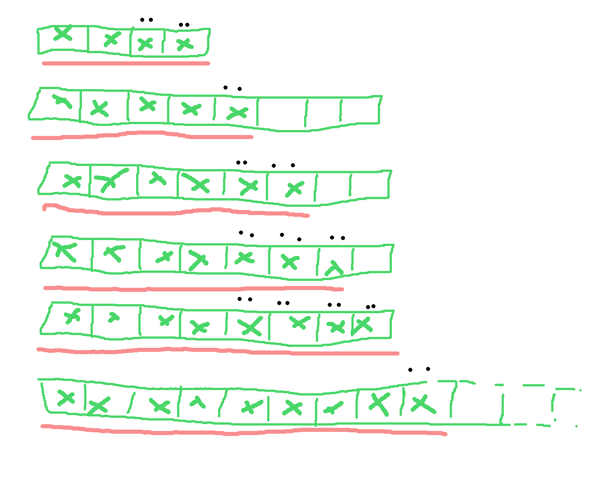

# Tableau dynamique & complexité amortie

## I. Tableaux Dynamique

Un tableau a une longueur fixée: au bout d'un moment, on ne peut plus y ajouter d'élement.
On veut y remédier. Plus précisément, on veut:
- pouvoir faire "T[i] <- x"
- pouvoir accéder à la valeur de "T[i]"
- pouvoir ajouter une case à la fin du tableau (et mettre un élément dedans)
- pouvoir enlever la case de fin du tableau(et renvoyer sa valeur)

L'idée est de conserver une paire `(T, len)` tq:
- T a au moins `len` case
- ses `len` première cases sont utilisées.

T:  [ 3 | -5 | 60 | ? | ? ]

Pour lire/modifier une case: facile, on lit/modifie T[i]

Pour ajouter un élement à la fin:
- écrire cet élément dans T[`len`]
- augmenter `len` de 1

Ex: si on ajoute 42 à l'exemple précédent, on obtient

T: [ 3 | -5 | 60 | 42 | ? ]

> [!CAUTION]
> **Attention** 
> Cette façon d'ajouter ne marche pas telle quelle si T est plein: il n'y a pas de case libre...

Dans ce cas:
- on crée un nouveau T deux fois plus grand
- on recopie l'ancien dans le nouveau
- on supprime l'ancien; on utilise dorénavant le nouveau
- on peut maintenant ajouter

Pour supprimer le dernier -> cf TD

Problème: quel est le coût d'une suite d'ajouts ?
- Chq ajout est pire linéaire en la taille du tableau
- Mais ces pires cas ne peuvent s'enchainer

## II. Complexité amortie

On considère une structure de données sur laquelle on effecture des opérations:

$\hspace{10pt}$ o1 $\hspace{10pt}$ o2 $\hspace{10pt}$ o3 
e0 - -> e1 - -> e2 - ->...

ei: les états successifs de la structure

oj: des opération qui altère la structure

NB;
l'indexation est choisie de la sorte à ce que oi parte de ei-1 et amène en ei

> [!NOTE]
> **Exemple** 
> T [ ] e0  (len = 0)
> *AJOUT(42) -- o1* 
> T [ 42 ] e1 (len = 1)
> *AJOUT(666) -- o2* 
> T [ 42 | 666 ] e1 (len = 2)
> *AJOUT(0) -- o2* 
> T [ 42 | 666 | 0 | ? ] e2 (len = 3)
> *AJOUT(-3) -- o3* 
> T [ 42 | 666 | 0 | -3 ] e3 (len = 4)
> *AJOUT(87) -- o4* 
> T [ 42 | 666 | 0 | -3 | 87 | ? | ? | ? ] e4 (len = 5)

On note ai le coût de l'op oj

> [!TIP]
> **Déf** 
> On dit que â1 â2 â3, ... ont des coûts amortis de o1 o2 o3... si pour toute suite de k opérations on a $\displaystyle \sum_{j=1}^{k} a_j <= \sum^k_{j=1} â_j$

Autrement dit, on veut que la somme des coûts amortis, vaille au moins autant que la somme des coûts réels

> [!CAUTION]
> **Rmq** 
> Certains âj peuvent-être sous-évalués (âj < aj), d'autres suréavalués (âj > aj): l'important est que $\sum a_j <= \sum â_j$

### 1. Méthode de l'aggrégat

Idée: Trouver une fonction f telle que $\sum^k_{j=1} a_j <= f(k)$

On pose alors $â_j = f(k)/k$

> [!NOTE]
> **Exemple avec les tableaux** 
> On considère une suite de k ajouts avec état initial vide (T=[?], len = 0)
> Compotons le coût en nb d'écritures
> $a_i = \begin{cases} 2 & \quad \text{si} \quad len_{i-1} \neq \text{taille(T)} \quad n > 0 \\ len_{i-1} + 2 & \quad \text{sinon} \end{cases}$

où:
- leni erst la valeur de len en ei
- taille(T)i est le nb de cases de T en ei

On montre par une réc simple: pour tout i, leni = i

Par une réc assez simple:

$taille(T)_i = \begin{cases} 0 & \quad \text{si} \quad i = 0 \\ 2^p & \quad \text{sinon} \end{cases}$

avec p = entiersup(log2i)

Ainsi, le cas couteux de ai a lieu lorsque i-1 est un $2^p$ donc lorsque i est de la forme $2^p-1$

D'où:

$a_j = \begin{cases}
    2   & \quad \text{si j n'est pas de la forme} \quad 2^p+1 \\
    2^p+1 + 2 & \quad \text{sinon}
        \end{cases}$

et $a_1 = 2$

Notons m = entiersup(log2k), i.e. $2^{m-1} < k <= 2^m$

On a :

$\displaystyle \sum^k_{j=1} a_i <= \sum^k_{j=1} 2 + \sum^{m-1}_{p=0} (2^p+1)$

$\displaystyle \sum^k_{j=1} 2$: T[len] <= x | len <- len+1 à chq fois

$\displaystyle \sum^{m-1}_{p=0} (2^p+1)$: coût du doublement (pour tt les puissances de 2 possible)

$\displaystyle \sum^k_{j=1} a_i <= 2k + m + (2^m-1)/(2-1)$

$\displaystyle \sum^k_{j=1} a_i <= 3k + ((k+1)-1)/1$

$\displaystyle \sum^k_{j=1} a_i <= 4k$

Posons f(k) = 4k

On en déduit le coût amorti $â_j = 4$ pour tout j

Ainsi on peut considérer que dans une suite d'AJOUT, chaque AJOUT a une complexité amortie O(1)

### 2. Méthode du comptable

L'idée est de considérer que certaines opérations "pré-payent" les opérations futures.

Méthode: à chaque op $o_j$ on considère:
- $a_j$ son, coût réel
- $s_j$ ce que l'on surpaye pour cette opération
- $d_j$ ce que l'on dépense pour cette opération

On pose alors $â_j = a_j + s_j - d_j$

On doit garantir que pour tout j, $\displaystyle \sum^j_{m=1} s_m >= \sum^j_{m=1} d_m$ (on ne dépsense pas plus que l'on pré-paye)

Preuve: $â_j$ est bien un coût amorti car :

$\displaystyle \sum^k_{j=1} â_j = \sum^k_{j=1} a_j + s_j - d_j$

$\displaystyle \sum^k_{j=1} â_j = \sum^k_{j=1} a_j + \sum^k_{j=1} s_j - \sum^k_{j=1} d_j$

$\displaystyle \sum^k_{j=1} â_j >= \sum^k_{j=1} a_j$

Ex: Pour rendre plus visuelle la méthode du comptable, on dira que l'on compte la complexité en "pièces".

On veut compter le nb d'écritures dans une suite de k ajouts. On considère que 1 écriture coute 1 pièce.

On va procéder ainsi:
- qd AJOUTE ne double pas le tableau, on paye 2 pièces pour écrire T[len] <- x et len <- len+1. Ensuite, on "pose" 2 pièces de plus sur la case que l'on a écrite

> [!NOTE]
> **Exemple** 
> T [ ] (len = 0)
> T [x] (2 picèces stockées) (len = 1)

- quand AJOUTE doit doubler le tableau: les cas de $len_{i-1}/2$ à $len_{i-1} - 1$ contiennent chacune 2 pièces: on les dépense pour payer la copie des $len_{i-1}$ valeurs, et on stocke 2

> [!NOTE]
> **Exemple** 
> T [x] (2 picèces stockées)
> T [x | y] (la copie a été payé par les pièces de x)

On somme les 8/2, 2pieces pour payer la recopie des 8 cases

Lemme: Avec $n_{i-1}$ le nb de cases du tableau: les cases d'indice [| $n_{i-1}/2, len_{i-1}$ [| Contiennent tt 2 pièces

En particulier, lorsque $len_{i-1} = n_{i-1}$ il y a assez de pièces pour payer le doublement

Preuve: par rec simple

Ainsi on obtient dans les deux cas $â_j = 4$

Ainsi, au sein d'une suuite de k AJOUT, chq AJOUT a un coût amorti O(1)

### 3. Méthode du potentiel

L'idée est de ne pas faire des stocks d'op pré-payés "locaux" mais de constater un potentiel "global"

> [!TIP]
> **Déf** 
> Pour une suite de k op $o_1, o_2, ...$, on veut une fonction Q tq: on note $Q_i = Q(e_c)$, nommé le potentiel de l'état $e_i$

- on pose $â_j = a_j + Q_j - Q_{j-1}
- on doit garantir que pour tt i, $Q_i >= Q_0$

Preuve: $â_j$ est un coût amorti car:

$\displaystyle \sum^k_{j=1} â_j = \sum^k_{j=1} (a_j + Q_j - Q_{j-1})$

$\displaystyle \sum^k_{j=1} â_j = \sum^k_{j=1} a_j +  \sum^k_{j=1} (Q_j - Q_{j-1})$

$\displaystyle \sum^k_{j=1} â_j = \sum^k_{j=1} a_j + Q_k - Q_0$

$\displaystyle \sum^k_{j=1} â_j >= \sum^k_{j=1} a_j$

> [!NOTE]
> **Exemple** 
> Considérons une suite de k AJOUTE à partir de (T=[?], len = 0) 
> Notons $n_i$ le nb de cases de T en état $e_i$ 
> Posons $Q_i = 2 len_i - n_i$ 
> On a alors $Q_0 = -1$
>
> si AJOUTE ne double pas: 
> $n_i$ = $n_{i-1}$ 
> $len_i = len_{i-1} + 1$ 
> Donc $Q_i = Q_{i-1} + 2$ 
> et on a alors $a_i = 2$
> 
> si AJOUTE double: 
> $n_i = 2n_{i-1}$ 
> $len_i = len_{i-1}+1$ 
> et $a_i = len_{i-1}+2$
>
> $Q_i - Q_{i-1} = 2 len_i - n_i - (2len_{i-1} - n_{i-1})$
> 
> $Q_i - Q_{i-1} = 2 (len_i - len_{i-1}) + (n_{i-1} - n_{i})$
>
> $Q_i - Q_{i-1} = 2 - n_{i-1} = 2-len_{i-1}$

Notons $n_i$ le nb de cases du tableau. À partir de $i=1$, le tableau est au moins à moitié rempli, donc

$n_i/2 <= len_{i} <= n_i$

Il s'ensuit qie $Q_i = 2len_i - n_i >= 0 >= Q_0$

D'où pr tt i, $Q_i = Q_0$