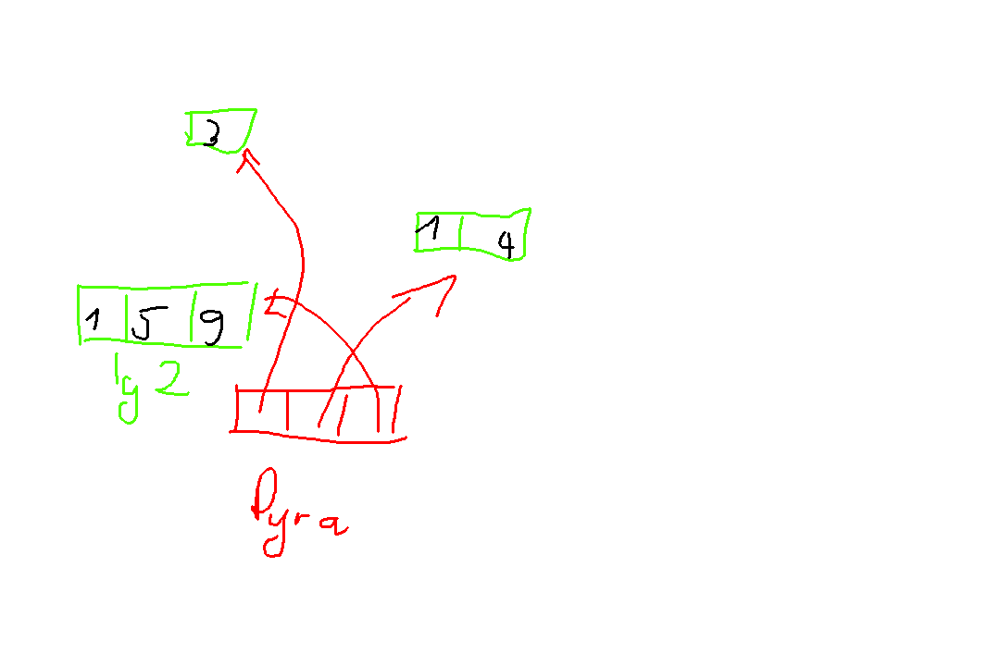
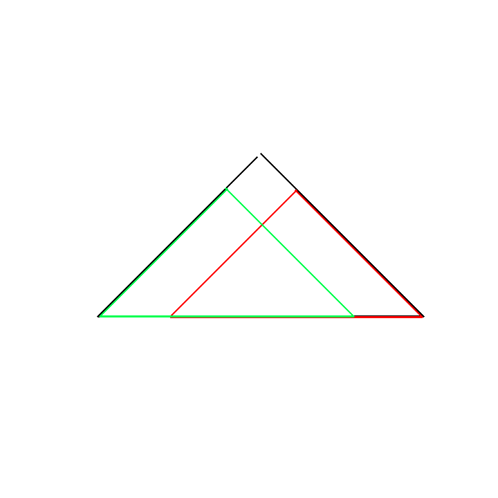

# Diviser pour régner

## I - Principe général

Méthode: La technique du Diviser Pour Régner ("Divide to Conquer") consiste à résoudre réc un prblm comme suit:
1. Séparer l'instance du prblm en p >= 2 instances de ce prblm, tt de même taille (si n est la taille de l'instance, les p ss-prblm sont n/p)*

2. Résoudre rec ces p instances

3. Fusionner les solutions de ces p instances en la solution du prblm initial


> [!CAUTION]
> **Rmq**<br>
> - On réduit donc le pb à lui-même, sur des instances + petites: c'est bien de la rec
> - Il y a DEUX choises à inventer: la séparation ET la fusion

Ex: le Tri Fusion:
1) Diviser la liste en 2, arbitraiement
2) Trier rec les 2 moitiés
3) Fusionner les 2 moitiés triées en la liste triée

> [!CAUTION]
> **Rmq**<br>
> on admet parfois p=1 comme du DPR, par ex la dichotomie


> [!IMPORTANT]
> **Propriété/Remarque**<br>
> Pour une instance de taille n, divisée en p instances avec un coût C_sépare de la séparation, C_fusionne de la fusion, la complexité T(n) vérifie<br>
> T(n) = C_sépare(n) + pT(n/p) + C_fusionne(n)
>
> C'est l'éq typique d'un DPR! On réunit souvent C_sépare et C_fusionne en C_local:
>
> T(n) = pT(n/p) + C_local(n)

## II - Analyse de la complexité

T(n) = pT(n/p) + C_separe(n) + C_fusion(n)


> [!CAUTION]
> **Rmq**<br>
> - Dans une eqation de complexité, quand on indique pas le cas de base, c'est qu'il est de la forme T(1) = cst (pour une bonne valeur de 1)
> - on peut mq les éventuelles $\lceil\rceil$ et $\lfloor\rfloor$ dans T(n/p) ne change pas l'ordre de grandeur
> - en réalité, on a plus svt T(n) <= ... que T(n) = ... : ça résoud pareil


Comment résoudre? On trace l'arbre d'appels

cf schéma cahier DPR.1


## III - Programmation dynamique

### 1. Présentation

Les méthodes de division en sous-problèmes peuvent ê inefficace si les ss-problèmes "se chevauchent: on recalcule alors plusieurs fois les meme sous-prblm: c'est du gaspillage.

Pour éviter ce recalcul, on peut mémoriser la solution d'un ss-prblm qd on la calcule, et la rréutiliser si on doit recalculer le ss-prblm

> [!IMPORTANT]
> LA PROG DYNAMIQUE C'EST DE LA RÉCURSION INTELLIGENTE, PAS "REMPLIR DES TABLEAUX"

### 2. Ex fil rouge: pyramide d'entiers

Prblm: on prend en entrée une "pyramide d'entiers". On doit trouver le ch de poids max (on ne peut que descendre). La pyramide a nb_lgn lignes et (i+1) entiers sur la lgn i. On la centre visuellement

On modélise la pyramide comme suit:

```
    3
  1   4
1   5   9
```

Pour chq lgn, on crée un tableau/zone mémoire qui contient les elems de la lgn.

La pyramide est alors le tagleau des lgn

La pyramide est alors le tableau des lgn

En C, on n'utilisera pas des tableaux mais plutôt des ptr vers des zones allouées.

</img>

Pyramide contient des int*, donc est un int**

Idée réc:
pour chq noeud, on définit sa sous-pyramide gauche et droite (cf schéma annexe)

Lemme: un chemin depuis le sommet de la pyramide est soit:
- sommet puis on "va à gauche" et la suite est un chemin de la sous-pyramide gauche
- sommet puis on "va à droite" et la suite est un chemin de la sous-pyramide droite

En notant opt (i, j) la valeur d'un chemin descendant maximal depuis le noeud d'indice [i] [j] on a :


opt(i, j) = pyramide[i][j] + max( opt(i+1, gauche(j)), opt(i+1, droite(j))) si i < nb_lgn - 1

= pyramide[i][j] sinon

On peut utiliser cette formule: cf recursion naive annexe

T(i, j) = T(i+1, j) + T(i+1, j+1) + $\Theta$(1)

Par symétrie, T(i+1, j) et T(i+1, j+1) st égaux: on exprime T uniquement en fonction de i:

T(i) = 2T(i+1) + $\Theta$(1) et T(nb_lgn - 1) = $\Theta$(1)

Donc T(i) = $\Theta(2^{nb\_lgn - i})$

Complexité spatiale:

Ne sont en mémoire que les appels ouverts non encore fermés, c'est à dire au plus ine hauteur de l'arbre $\Theta$(nb_lgn - i) chq appel requiet un espace cst

Donc la complexité spatiale est un $\Theta$(nb_lgn - i)

### 3. Recouvrement, mémorisation

On remarque que des ss-pyramides sont calculées plusieurs fois:



Solution: mémoriser les valeurs de opt(i, j)

Avant de calculer un opt(i, j), on va d'abord vérifier s'il n'est pas déjà en mémoire

Code: mémorisation descendante en annexe

On a 2 fonctions:
- memo_valeur_chemin...: elle effectue l'idée de mémoisation ci-dessus. Elle prend en arg opt, la mémoire à màj.
- valeur_chemin...: elle crée opt puis se contente d'utiliser l'autre

C'est typiquement la prog dgn:
une récurrence "intelligente" qui requiert une mémoire, et la famille principale qui crée cette mémoire.

Rmq:
- on sait pas pourquoi le r mémorisation a disparu
- cette solution part du sommet et descend rec dans la pyramide jsq'à la base: on parle d'approche de **haut en bas** (top-down)
- on n'a pas à gérer l'ordre de calcul des pyramides à la main: c'est la réc qui le fait. Parfois, on ne sait meme pas quel est cet ordre de calcul: la réc permet de ne pas y penser
- la rec ne calcule que les ss-prblm utiles à la valeur demandé

Complex0ité de meme_chemin_max:

chq case de opt est calculée au plus une fois. Ce calcul se fait en tps cst à l'aide des autre case. Chq case est demandé au + 2 fois par "en haut à gauche" et par "en haut à droite"

D'où une complexité temporelle

O(nb_de_cases) = O( Sigma{nb_lgn-1, l=0, l+1}) = O(Sigma{nb_lgn, l=1, l}) = O(nb_lgn^2)

ie on est passés de O(2^nb_lgn) à I(nb_lgn^2)

Complexité spatiale de memo_ch...:
- on crée O(i) en mémoire pour les memes raisons de récursions q le naif. (et elle est automatiquement libérée)
- par contre, on écrit dans opt ce qui fait que l'on écrit au plus O(nb_lgn^2) cases mémoires

Complexité temporelle de valeur_ch_max :
- créer nb_lgn lignes se fait en O(nb_lgn)
- initialiser ces lgn est en O(nb_lgn^2) (car c'est le nb de cases)
- l'appel à memo_... est en O(nb_lgn^2).
- les free, ĉ la création, en O(nb_lgn)

Auto total, la complexité est en O(nb_lgn^2)

Complexité spatiale:
- on créer O(nb_lgn^2) cases
- on appelle memo_... qui requiert:
  - ces cases
  - et O(nb_lgn) espace

D'où la complexité spatiale O(nb_lgn^2)

Rmq: on a payé un coût un espace (l'espace de mémoisation) pour accélérer grandement le temps

### 4. Approche bottom up

Idée: si on connait l'ordre dans lequel les ss-prlbm doivent ê résolu on peut éviter la réc et peut-ê optimiser l'espace

Dans notre exemple:
- les sous-pyramides dt le sommet est sur la lgn nb_lgn-1 n'ont pas de ss-pyramides: on calcule directement leur valeur
- ----------------------------------- nb_lgn - 2 n'ont besoin que de nb_lgn - 1 et peuvent donc mtn ê calculées
- puis nb_lgn-3
  
etc: on peut calculer par indice decroissant des sommets, ie en partant de la lgn du bas et en remontant.

On parle de méthode de bas en haut (bottom-up). Elle n'est pas réc.

Code: cf annexe bottom-up, calcul de tt les lgn

Complexité temporelle:
- en dehors des boucles, nb cst de lecture/écriture/malloc/free -> $\Theta$(1)
- La boucle de création itère nb_lgn fois et son corps est en temps constant -> $\Theta$(nb_lgn)
- idem pour l'initialisation
- idem pour les free
- le corps du double for imbriqués est en $\Theta$(1) la boucle intérieure itère (lgn+1) fois. La boucle intérieur itère de lgn=nb_lgn-2 à lgn=0 de 1 en 1, d'où :

$\sum^{nb\_lgn-2}_{lgn=0}\Theta(lgn+1)$ = $\sum^{nb\_lgn-1}_{lgn=1}\Theta(lgn)$ = $\Theta(nb\_lgn^2)$ = 

Donc au total la compléxité en $\Theta$(nb_lgn^2)

Complexité spatiale
- comme avant: $\Theta$(nb_lgn^2), sauf que le terme linaire lié à la rec a disparu

On peut améliorer cette complexité spatiale en remarquant que la lgn i+1 ne sert à rien une fois la lgn i calculée: on peut ne mémoriser à tt moment que 2 lgn de opt : celle en cours et la préc

Complexité temporelle: comme avant, avec la création et la suppr de opt en $\Theta$(1)

Complexité spatial: on ne crée que 2 lgn (de longueur nb_lgn+1) et des var locales: $\Theta$(nb_lgn)

Complexité spatiale:
- comme avant: $\Theta$(nb_lgn^2), sauf le terme linéaire lié à la rec a disparu

Pour aller encore plus loin, on peut sotcker 1 seule ligne.

L'idée est que:
- la valeur (i, j) sert à calculer (i-1, j-1) et (i-1, j)
- Dc si on calcule par j croissant, (i, j) ne sert plus après (i-1, j). On peut donc réutiliser l'esp de (i,j) pour (i-1, j)

### 5. Reconstruction de la sol opt

Ici, on a uniquement calculée la valeur d'un plus lourd chemin, pas le chemin en lui-même. C'est assez courant, et on procède en général de 2 façons pour (re)constuire la sol opt en elle-même

Si l'on a travaillé de bas en haut et mémorisé tt les valeurs de sol opt intermédiares, on peut reconstruire la sol opt.

Ex sur la pyramide:
- partir du sommet
- ensuite, aller à g ou à d, selon si opt[][gauche] ou opt[][droite] est maximal. Etc jusqu'en bas. ie on reconstruit la suite de choix optimaux faite lors du calcul de la valeur.
- dans l'algo de grog dyn, ne pas mémoriser que la valeur d'une sol opt. mais aussi la sol associée

Ex: ne pas mem que opt(i, j) mais aussi le ch associée


Inconvénient de la 1iere méthode:
- plus long: la reconstruction peut prendre du tps s'il y a bcp de choix possibles (ex: analyse syntaxique escendante en MPI)
- on a besoin d'avoir tt les valeurs opt mémorixées: on ne peut pas réduire en deça le coût mémoire

Inconvénient de la 2eme méthode:
- plus dur à coder
- demande plus d'espace (mais on peut faire de l'optimisation ĉ sur les pyramides)

### 6. Top down vs bottom up


Récursif

Pros:
- pas besoin de réflechir à l'ordre de calcul
- ne calcule q les valeurs nécessaires

Cons:
- coût spatial de la réc

Itératif

Pros:
- on peut optimiser l'espace
- pas de coût spatial rec

Cons:
- il faut plus réfléchir (notamment pour l'ordre de calcul)
- /!\ aux erreurs d'indices