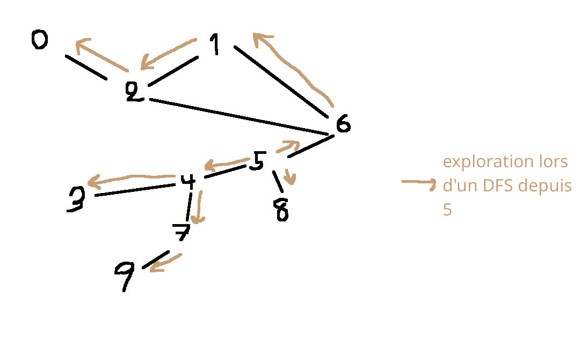
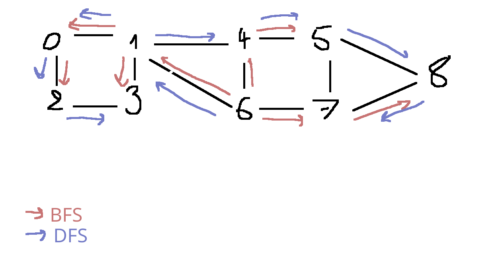

# Graphes


Il est composé des **sommets** (ou noeuds) {1, 2, 3, ..., 12} relié ou non par des **arêtes**. Les arêtes peuvent former des **chemins** ou des **cycles**


> [!CAUTION]
> **Rmq**<br>
> Un graphe est très naturel pour repr des éléments en relation: les elems sont les sommets, et 2 elems st reliés s'ils sont en relation<br>
> On parle de str de données relationnelle.

En MP2I, on se limite à "1 arête relie 2 sommets". On peut imaginer qu'une arête relie tout un "paquet" de sommets: on parlerait d'hyperarête

- modélisation très natirelle pour les problèmes de réseaux.
- modelisation des prblm de contraintes: 2 sommets reliés st incompatibles pour une certaine contrainte

Ex: pour le prblm Interval Partionning, on peut repr les interv par des sommets et relier  intervalles s'il s'intersectent


Un graphe aisni obtenu est appelé graphe d'intervalle ou graphe cordal. Ils ont de bonnes pptes

et bcp bcp bcp d'autres prblm se modélisent ainsi

## I - Déf et 1ère manip

### 1. Graphes non-orentiés

> [!TIP]
> **Déf**<br>
> Un graphe nn-orienté est la donnée d'une paire (S,A) où:
> - S est un ensemble d'éléments appelés sommets
> A C= {{x, y} / x€S, y€S, y!=x}
>
> Un sommet a lui-même est un ensemble d'arêtes

Ex: sur le graphe initial, S=[| 1; 12 |] et A = {{1; 2}, {2; 3}, {3; 4}, ...}

> [!CAUTION]
> **Rmq**<br>
> A contient des parties à 2 élém et nn des paires car on veut une symétrie. Or {x; y} = {y; x} mais (x, y) != (y, x)

- en anglais, "sommets" = "vertices", "arêtes" = "edges". On note donc parfois (V, E) un graphe
- cette déf interdit:
  - les arêtes d'un sommet vers lui-même
  - plrs arêtes entre 2 même sommets<br>on peut changer la déf pour inclure cela au besoin
- Visuellement, sommet = rond, arête = trait

Notation: dans G=(S,A) un graphe, pour x€S, y€S, on note x-y ou xy si {x; y} € A


Preuve: pour créer une arête, on doit choisir x et y:
- n choix pour                   ) 
- n-1 choix pour y car y != x    ) n*(n-1)

On a compté chq arête 2 fois: {x,y} et {y,x}

Donc n*(n-1)/2

Lemme: un ch de lg min de x à y est élémentaire

Preuve: par contrap. Si (s_0 = x), ..., (s_p = y) est un ch de x à y non-elem, alors il existei, j tq s_i = s_j

Mais alors s_0, ..., s_i, s_j+1, ..., s_p est un ch plus court, donc le ch n'atait pas minimal.

Preuve: si y est acc depuis x, prenons un plus court ch qui est donc elem

Dc (1) => (3)

Or, (3) => (2) et (2) => (1) par def. Dc (1) <=> (2) <=> (3)


**Complexités temporelles**

- Tester si uv€A : $\Theta$(1)
- Parcourir tous les voisins de s€S : $\Theta$(|S|)
- ajout/retrait uv: $\Theta$(1)
- --------- sommet: $\Theta$(|S|^2) (Il faut tout recréer car les tab ne sont pas redimensionables)

**Complexité spatiale**: la matrice est de taille $\Theta$(|S|^2)


> [!CAUTION]
> **Rmq**<br>
> si le graphe est "creux", càd s'il a peu d'arêtes, on utilise bcp d'espace pour stocker la non-existence d'arêtes: on peut faire mieux dans ce cas

### 2. Par listes d'adjacence


> [!TIP]
> **Déf**<br>
> Soit s€S. La liste d'adjacence de s est la liste de ses voisins.

La repr par listes d'ajacence de G est la donnée du tableau T tel que T[s] est la liste d'adjacence de s, pour tt s€S


Plusieurs façons d'implémenter les listes d'adja existent:
- une list chainée / un tab dyn
- réserver pour chq liste un espace $\Theta$(|S|) n'en utiliser que les deg(s) 1ieres cases

C'est comme les tab dyn, sauf qu'on reserve tout de suite la taille max

+: + simple
-: gaspillage d'espace

réserver pour les chq liste $\Theta$(S), et dans la deg(s) + 1ieme case mettre une sentinelle de fin


> [!CAUTION]
> **Rmq**<br>
> la notion de sentinelle de fin est celle du '\0' de char*

- On peut ou nn garantir le tri de listes d'adja

Complexité temporelles (pour des listes d'adja chainées non-triées sans doublons)
- présence de uv€A: $\Theta$(deg(u))
  - on parcourt tt la liste de u
- parcourt des voisins de s€S: $\Theta$(deg(s))
  - idem
- ajout/retrait de uv: $\Theta$(deg(u))
  - On parcourt les voisin de u pour voir si y est déjà
  - /!\ Si nn orienté il faut ensuite enlever vu
- ajout/retrait d'un sommet: $\Theta$(|S|)
  - Il faut étendre/réduire T
  - /!\ pour l'ajout, ne pas oublier d'ajouter les nouvelles arêtes
  - /!\/!\ Pour le reatrait il faut retirer le sommet de tt les listes d'adja, soit au total $\Theta$(|S| + |A|)

> [!CAUTION]
> **Rmq**<br>
> Bonne repr qd il y a peu d'arêtes, car alors deg(s) petit et |S| + |A| << |S|^2

Complexité spatiale: $\Theta$(|S| + |A|)
car:
- 1 case par sommet
- 1 elem de liste par arête/arc

### 3. Graphes implicites

Idée: plutôt que de donner soit A on done un our plsr sommets de départ...


> [!NOTE]
> **Exemple**<br>
> Graphe des échecs
> - S= ens des états du plateau pouvant exister
> - A: 1 arête = 1 coup
>
> Ce graphe a environ 10^40 - 10^50
>
> On ne peut le calculer

Par contre, on peut facilement donner l'état initial et les règles du jeu.

---

On veut mq |A| >= (n+1)-1 donc que |A'| >= n-1

Mq G' le graphe induit par S' est connexe. Soient (x,y) 2 sommets de S' (donc x!=u et y!=x)

Par connexité, il existe un ch élem de x à y dans G. Ce chemin ne passe par u puisque x, ..., v, u, v, ..., y n'est pas elem

Donc ce che est un chemin de G'

Donc G' est connexe à n sommets donc |A'| >= n-1 par HR ce qui conclut.


# IV - Parcours de graphe

## 1. Parcours générique

On s'inspire du parcours des arbres, sauf que l'on retient les sommets déjà visités pour ne pas rester bloqués dans un cycle. Çàd on se déplace sur le graphe. La première fois que l'on rencontre chq sommet, on y effectue un "traitement" (qui dépend du pb modélisé)


*Ya un sac aussi mais flemme de le faire, c'est juste il contient les noeuds*

Ordre d'entrée dans le sac | Ordre de sortie dans le sac/traitement
--|--
3 | 3
4, 6, 7 | 6
7 | 4
1, 5, 8, 7 | 1
0, 2 | 1
-- | 7 -> déjà traité
-- | 5
2, 8 | 8
-- | 2
-- | 7 -> déjà traité
-- | 0


C'est à dire que:
- on a une structure de "Sac" où l'on stocke les prochains à visiter. Il peut contenir les doublons
- Initialement, le sac contient un sommet s_0 choisi
- Tant que le sac est non-vide, on en sort un sommet, on le traite et on ajoute au sac ses voisins non-encore traités

Pseudo-code: sur la feuille


> [!CAUTION]
> **Rmq**<br>
> /!\ Ici on marque un sommet comme déjà vu à **sa sortie** du sac, càd lors de son traitement traitement. Parfois, on marque plutôt à l'entrée: on parle de marquage anticipé

On parle parfois de sommets Blanc, Gris ou Noirs, cela est svt défini ainsi:
- Blanc = jamais entré dans le sac
- Gris = entré, non-encore sorti
- Noir = déjà sorti/traité


> [!IMPORTANT]
> **Propiété**<br>
> le parcours traite exactement les sommets accessibles depuis s_0
>
> Preuve:
> 1. "Tout sommet entré dans le Sac est accessible depuis s_0" est un invariant de la boucle car:
>   - Intialement le sac contient uniquement s_0
>   - à chq iter, les éléms ajoutés sont des y voisin de x (lequel était dans le sac). Donc il y a un chemin s0 --------> x -> y<br><br>
> Donc tt sommet traité est accessible
>
> 2. Supp par l'abs x€G accessible depuis s_0 mais non-traité, et prenons le minimal pour d(s_0, x)
> 
> Soit s_0, s_1, ..., s_l (=x) un plus court ch de s_0 à x
> <br><br>
> Par min de x, s_{l-1} a été traité. Mais son traitement aurait dû insérer x son voisin, et x aurait alors fini par sortir et ê traité: abs
>
> 1\) et 2) concluent la preuve


> [!IMPORTANT]
> **Corollaire**<br>
> Un parcours permet de calculer les sommets accessibles depuis s_0. Donc de tester la connexité d'un graphe nn-orienté

> [!IMPORTANT]
> **Corollaire**<br>
> Si l'on peut retirer et ajouter des sommets au sac en tps cst, et sans prendre en compte le temps de traitement d'un sommet, pour un graphe repr. par la listes d'adja, on a la complexité temporelle:<br>
> T(G) = O(|S| + |A|)
>
> ### Preuve:
> 
> Chq sommet est traité au plus 1 fois, et inséré au plus autant de fois qu'il a de voisins. Le traitement d'un sommet se fait en temps deg(s) + 1
>
> Donc T(G) <= (Somme(s€S, deg(s)+1)) = O(|A| + |S|)


---
8 avril


> [!TIP]
> **Déf**<br>
> Soit G=(S,A) un graph et x€S. Lors d'un parcours de G, on note (s'il existe) pred(x) le sommet y dont la visite a inséré dans le sac la 1iere copie de x qui est sorti du sac.

## 2. BFS

Comme dans les arbres, si le Sac est une file, on explore les sommets par distance croissante au sommet initial $s_0$

Exemple:


> [!TIP]
> **Déf**<br> On appelle arbre de parcours en largeur l'arbre obtenu en ne gardant que les sommets accessibles depius $s_0$ le sommet initial et les (pred(x), x) comme arcs


> [!IMPORTANT]
> **Propriété**<br>
> C'est bien un arbre
>
> **Preuve:** montrons que, sans son orientation, c'est un arbre<br>
> On sait que:
> - chq arête est un (pred(x), x) <- Autant d'arêtes que de pred
> - chq sommet a un unique prédecesseur <- Autant de pred que de sommets, racine exclue
>
> Donc il y a n-1 arêtes
>
> Pour la connexité, on mq: << Pour tt sommet x traité, $x, pred(x), pred^2(x), ...$ est un chemin fini de x à $s_0$ le sommet initial >> est un invariant (Admis)
>
> Pour tous sommets x, y, on a alors un chemin x, ..., $s_0$, ..., y

> [!IMPORTANT]
> **Propriété**<br>
> Pour un BFS, on peut utiliser un marquage anticipé et obtenir le même ordre de parcours
>
> **Preuve:**
>
> L'ordre de parcours est l'ordre de sortie de la File. Or, la File est FIFO, donc l'ordre de parcours est l'ordre d'entrée: des doublons ajoutés + tard ne chg rien, on peut ne pas les ajouter


> [!IMPORTANT]
> **Théorème**<br>
> - L'arbre d'un BFS est un arbre de plus courts chemin de $s_0$ le sommet initial vers les sommets accessibles.
> - Le BFS parcourt par distance croissante à $s_0$
>
> **Preuve:** adapter les arbres


Code OCaml: cf annexe

## 3. DFS (récursif)

**Idée:**

On "s'enfonce" le + possible dans le graphe. Lorsque l'on est bloqués; on revient sur nos pas jusqu'à trouver un nouvel embranchement.

C'est un parcours naturellement récursif



Pseudo-code: cf annexe

> [!IMPORTANT]
> **Théorème**<br>
> L'arbre de parcours d'un DFS (ie l'arbre des (pred(x), x)) est un arbre T=(S,A) enraciné en $s_0$ le sommet initial qui vérifie: 
> 
> Si xy est une arête de G qui n'est pas dans T, alors x est ancêtre de y dans T ou y de x
>
> **Preuve:** Admis/MP

Ex:



2-3 ne vérifie pas la ppté pour un BFS mais la vérifie pour un DFS

> [!CAUTION]
> **Rmq**<br>
> Ce thm dit que << si l'on a pas emprunté xy, c'est que lorsque l'on a visité on s'est enfoncé dans un autre chemin qui a mené à y (ou l'inverse)>>


## 4. Parcours Pile

Si l'on prend le parcours générique où le Sac est une Pile, on obtient:
- un DFS si l'on marque en sortie du Sac/Pile
- /!\ **PAS** un DFS si marquage anticipé /!\

contre-ex pour le 2nd point:


est obtenu avec un parcours Pile et marquage anticipé. L'arête 2 - 3 ne vérifie pas le thm

> [!CAUTION]
> **Rmq**<br>
> Ce parcours n'est pas un BFS non-plus
>
> 

## 5. Parcours du graphe en entier

Rappel: un parcours ne visite que les sommets accessibles depuis $s_0$

Si on veut tous les visiter, on peut procéder par parcours successif:

```
Pour chq sommet: 
  s'il n'a pas été marqué lors d'un parcours précédent:
    Lancer un parcours depuis ce sommet.
```

Complexité: ss les même hyp que le parcours général, on a:

C(G) = $\Theta$(|S| + |A|) si les listes d'adj = $\Theta$($|S|^2$) si matrices d'adj