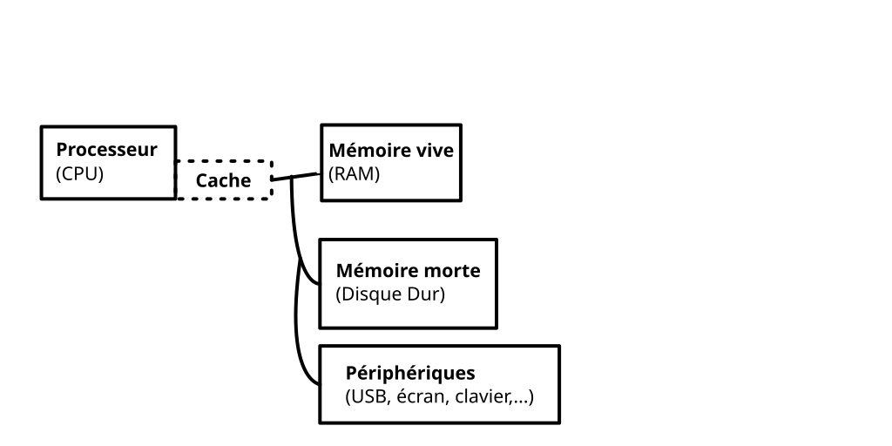

# Organisation De La Mémoire

## I - Schéma physique d'un ordinateur



**Processeur:** **Central Processing Unit**, c'est lui qui fait les calculs. Il a plusieurs "coeurs" (plrs mini-cpu), qui peuvent calculer en même temps. Sa vitesse de calcul est de 2.10⁹ Hz (par coeur)

Cache (Hors Programme): petite mémoire proche du processeur, Très rapide d'accès, on y pré-charge des morceaux de la RAM pour y accéder plus vite.<br>
Volatile 🐦🐦🐦🐦🐦🐦🐦🐦

**Mémoire:** "environ 8Go" modérement rapide d'accès.<br>
Volatile: s'efface à l'extinction.<br>
C'est la que les données d'exécution de nos programmes sont stockées

**Mémoire morte:** "environ 50Go" lente d'accès<br>
Pérsistante: n'est pas modifiée par l'extinction

**Périphériques:** Entrées/Sorties branchées à la machine

Un programme n'interagit pas directement avec les composants physiques. Il y a un super-programme dont le travail est d'ordonner ces interactions: c'est le système d'exploitation (Operating System)

Ex d'OS:
- GNU/Linux: dominants sur les serveurs (de très loin) et chez les informaticiens
- Android (dérivé de Linux): dominant sur les smartphones
- Windows: dominant sur les machines personnelles
- (macOS: dérivé de Unix, un ancêtre de Linux)

> [!CAUTION]
> **Rmq**<br>
> Linux est une très grande famille d'OS, qui peuvent être très différents

Dans ce cours on étudie comment la RAM est "vue" par un programme: on parle de mémoire virtuelle

## II - Orgranisation de la VRAM

### 1. Portée, Durée de vie

> [!TIP]
> **Rappel**<br>
> La portée d'un identifiant est l'ensemble des endroits où on peut l'appeler. Elle peut-être :
> - globale (jusqu'à la fin du fichier, à partir de la déclaration de l'id)
> - locale (à partir de la déclaration jusqu'à un certain point)
> 
> Il peut y avoir masquage: dans la portée d'un identifiant `id`, on crée un autre identifiant identique `id`. La portée de ce nouvel id est une zone où on ne peut pas accédder à l'ancien ("le plus récent l'emporte").

> [!NOTE]
> **Exemple**<br>
> ```ocaml
> let y = (let x = 3 in let x = x+2 in x/2)
> ```
>
> `y`: Déclaration globale: portée: de la fin de sa déclaration à la fin du fichier
> `x`: local + masquage toujours en local

Certains id ont besoin que leur portée **inclut** leur déclaration: ils sont récursifs

> [!NOTE]
> **Exemple**<br>
> ```ocaml
> let rec f = fun n -> if n = 0 then 0 else f n+1
>```
>
> `y`: f id rec

> [!TIP]
> **Def**<br>
> La durée de vie d'un objet mémoire est l'ensemble des zones de code où cet objet "existe", ie a une valeur connue

> [!NOTE]
> **Exemple** en C<br>
> `|` portées de n
> `-` durée de vie du contenu de n (vide)
> ```C
> int n;
> |int s = n+2;
> |
> // NON ! n n'a pas de valeur, Undefined Behavior, Ici Portée, mais pas Vie
> ```
>
> ```C
> |- int n = 2;
> |- {
> .-   int n = 0;
> .-   int s = n*2;
> |- }
> |- int x = n+1;
> ```

> [!IMPORTANT]
> **Propiété**<br>
> Il y a trois sortes de durées de vie en C:
> - statique: l'objet est **toujours** défini en mémoire, il est **toujours** vivant
> C'est le cas des variables globales coonues à la compilation
> - automatique: l'objet n'existe en mémoire que durant un bloc (généralement sa portée). Il est automatiquement supprimée à la fin. C'est le cas de la plupart des variables locales.
> - allouée: on contrôlera à la main >> le début et la fin de la durée de vie (en C, malloc/free)

> [!TIP]
> **Déf**<br>
> Certains langages (dont OCaml mais pas C) essayent de détecter quand est-ce qu'un objet alloué ne pourra plus servir afin de le supprimer. On parle de "ramasse-miettes"

> [!CAUTION]
> **Rmq**<br>
> C'est pratique (pas à gérer la mémoire à la main, moins d'erreurs) mais cela ralenti le programme

> [!CAUTION]
> **Rmq**<br>
> La plupart des OS libèrent de force la mémoire d'un prgm à la fin de celui-ci

> [!IMPORTANT]
> **Propriété**<br>
> Les objets à durée de vie automatique en C ont une propriété intéressante: si des blocs sont imbriqués le premier bloc à "naite" sera le dernier à "mourir"

> [!NOTE]
> **Exemple**<br>
> ```C
> | int f(int n) {
> |     int s = 0;
> |     int x = 3;
> |     - for (int i = x; iq10; i++) {
> |     -     * for (int j = x-i; j < x+2; j++) {
> |     -     *     s = s+j;   
> |     -     * }  
> |     - }
> | }
> ```
>
> `|` bloc et durée de vie du cours de la fonction<br>
> `-` bloc et durée de vie de la premiere boucle for<br>
> `*` bloc et durée de la vie de la seconde boucle for<br>
>
> On a l'ordre de naissance / mort suivant:
> naissance(s, x)<br>
> |<br>
> naissance(i)<br>
> |<br>
> naissance(j)<br>
> |<br>
> mort(j)<br>
> |<br>
> mort(i)<br>
> |<br>
> mort(s, x)<br>
>
> On parle de "LIFO"

### 2. Bloc d'activation

> [!TIP]
> **Déf**<br>
> Un bloc d'activation est un ensemble d'objets à durée de vie automatique qui naissent en même temps et meurent en même temps

> [!NOTE]
> **Exemple**<br>
> Dans l'exemple précédent, les variables de chaque bloc forment un bloc d'activation

> [!IMPORTANT]
> **Propriété**<br>
> - Les objets d'un même bloc d'activation seront les uns après les autres en mémoire
> - pour une fonction, le bloc d'activation inclut également:
>   - ses arguments
>   - des "méta-données" pour savoir à qui "répondre et rendre la main" à la fin de la fonction

> [!IMPORTANT]
> **Théorème**<br>
> En C, chaque bloc syntaxique ({...}) correspond à un bloc d'activation

> [!CAUTION]
> **Rmq**<br>
> les compilateurs modernes simplifient souvent et disent que chaque fonction correspond à un bloc d'activation