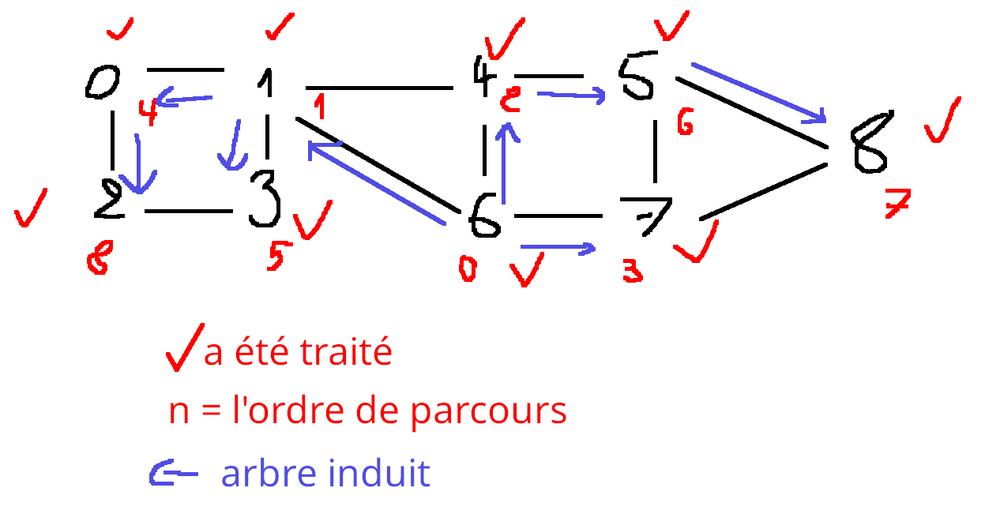
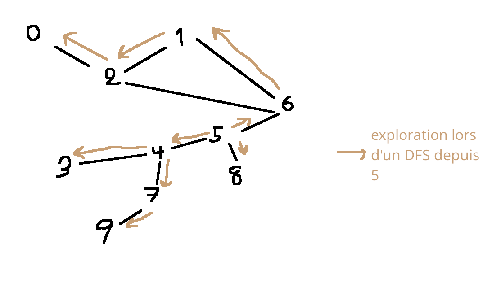
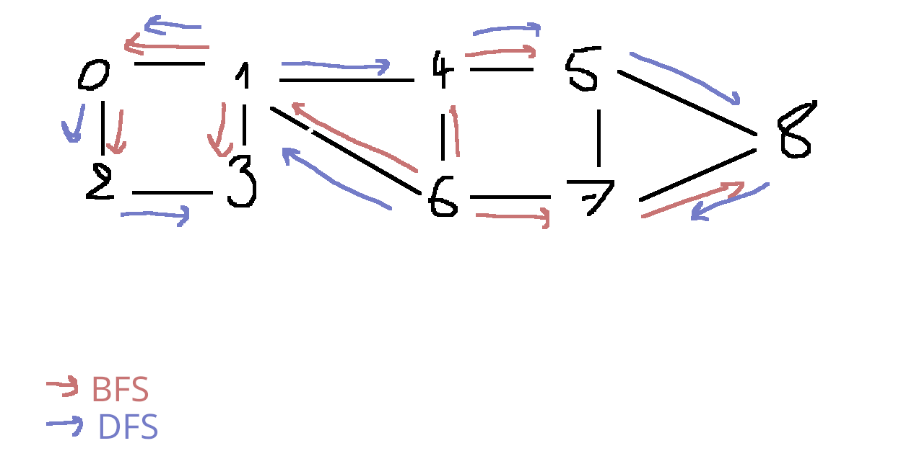
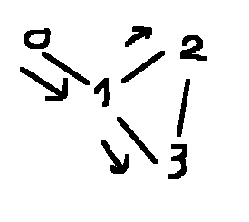
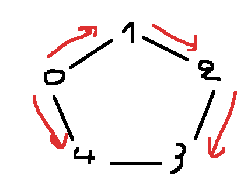

> [!TIP]
> **Déf**<br>
> Soit G=(S,A) un graph et x€S. Lors d'un parcours de G, on note (s'il existe) pred(x) le sommet y dont la visite a inséré dans le sac la 1iere copie de x qui est sorti du sac.

## 2. BFS

Comme dans les arbres, si le Sac est une file, on explore les sommets par distance croissante au sommet initial $s_0$

Exemple:



> [!TIP]
> **Déf**<br> On appelle arbre de parcours en largeur l'arbre obtenu en ne gardant que les sommets accessibles depius $s_0$ le sommet initial et les (pred(x), x) comme arcs


> [!IMPORTANT]
> **Propriété**<br>
> C'est bien un arbre
>
> **Preuve:** montrons que, sans son orientation, c'est un arbre<br>
> On sait que:
> - chq arête est un (pred(x), x) <- Autant d'arêtes que de pred
> - chq sommet a un unique prédecesseur <- Autant de pred que de sommets, racine exclue
>
> Donc il y a n-1 arêtes
>
> Pour la connexité, on mq: << Pour tt sommet x traité, $x, pred(x), pred^2(x), ...$ est un chemin fini de x à $s_0$ le sommet initial >> est un invariant (Admis)
>
> Pour tous sommets x, y, on a alors un chemin x, ..., $s_0$, ..., y

> [!IMPORTANT]
> **Propriété**<br>
> Pour un BFS, on peut utiliser un marquage anticipé et obtenir le même ordre de parcours
>
> **Preuve:**
>
> L'ordre de parcours est l'ordre de sortie de la File. Or, la File est FIFO, donc l'ordre de parcours est l'ordre d'entrée: des doublons ajoutés + tard ne chg rien, on peut ne pas les ajouter


> [!IMPORTANT]
> **Théorème**<br>
> - L'arbre d'un BFS est un arbre de plus courts chemin de $s_0$ le sommet initial vers les sommets accessibles.
> - Le BFS parcourt par distance croissante à $s_0$
>
> **Preuve:** adapter les arbres


Code OCaml: cf annexe

## 3. DFS (récursif)

**Idée:**

On "s'enfonce" le + possible dans le graphe. Lorsque l'on est bloqués; on revient sur nos pas jusqu'à trouver un nouvel embranchement.

C'est un parcours naturellement récursif



Pseudo-code: cf annexe

> [!IMPORTANT]
> **Théorème**<br>
> L'arbre de parcours d'un DFS (ie l'arbre des (pred(x), x)) est un arbre T=(S,A) enraciné en $s_0$ le sommet initial qui vérifie: 
> 
> Si xy est une arête de G qui n'est pas dans T, alors x est ancêtre de y dans T ou y de x
>
> **Preuve:** Admis/MP

Ex:



2-3 ne vérifie pas la ppté pour un BFS mais la vérifie pour un DFS

> [!CAUTION]
> **Rmq**<br>
> Ce thm dit que << si l'on a pas emprunté xy, c'est que lorsque l'on a visité on s'est enfoncé dans un autre chemin qui a mené à y (ou l'inverse)>>


## 4. Parcours Pile

Si l'on prend le parcours générique où le Sac est une Pile, on obtient:
- un DFS si l'on marque en sortie du Sac/Pile
- /!\ **PAS** un DFS si marquage anticipé /!\

contre-ex pour le 2nd point:



est obtenu avec un parcours Pile et marquage anticipé. L'arête 2 - 3 ne vérifie pas le thm

> [!CAUTION]
> **Rmq**<br>
> Ce parcours n'est pas un BFS non-plus
>
> 

## 5. Parcours du graphe en entier

Rappel: un parcours ne visite que les sommets accessibles depuis $s_0$

Si on veut tous les visiter, on peut procéder par parcours successif:

```
Pour chq sommet: 
  s'il n'a pas été marqué lors d'un parcours précédent:
    Lancer un parcours depuis ce sommet.
```

Complexité: ss les même hyp que le parcours général, on a:

C(G) = $\Theta$(|S| + |A|) si les listes d'adj = $\Theta$($|S|^2$) si matrices d'adj